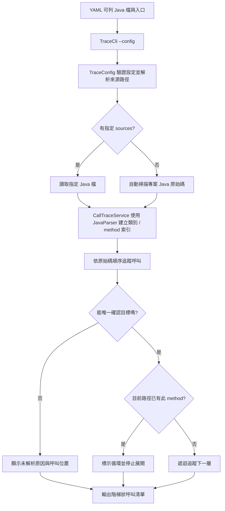

# JavaParser Call Trace MVP

以 **JavaParser** 從指定入口 method 追蹤呼叫，依原始碼順序輸出階層、縮排與 method 定義行號。

專案使用 Java 11，透過 YAML 設定檔指定來源與入口，再由 CLI 執行；單一檔案可以有多個 method，多個檔案也可以各自有多個 method。

## 功能

- YAML 可明確列出 Java 原始碼檔；省略 `sources` 時會自動掃描專案
- 在輸入檔中索引每個類別的多個 method
- 指定入口類別和 method，往下列出被呼叫的 method
- 依 method 呼叫在原始碼出現的位置排序
- 以階梯縮排表示呼叫深度，並顯示 method 定義行號
- 偵測目前呼叫路徑中的循環並停止展開
- 依 package、明確 import 和參數個數縮小呼叫目標；無法唯一確認時標示「未解析」
- 來源清單未包含被呼叫的類別、呼叫變數或遇到同參數個數的多載時，保留呼叫位置並說明原因

## 架構圖



## 環境需求

- JDK 11 或更新版本
- Maven 3.8 或更新版本

## CLI 使用方式

在專案根目錄開啟 PowerShell 或命令提示字元，執行內附的跨 package 設定檔：

```powershell
mvn exec:java "-Dexec.args=--config config/calltrace.yaml"
```

`config/calltrace.yaml` 的內容：

```yaml
entryClass: "com.javalight.app.Entry"
entryMethod: "start"
```

`sources` 可省略或設為空清單 `sources: []`。此時 CLI 會從專案根目錄自動索引 `.java` 檔，並略過 `.git`、`target`、`build`、`out`、`node_modules` 等產物目錄及常見測試原始碼目錄。追蹤輸出仍只會列出從 entry method 實際可到達的呼叫，不會把未呼叫的類別全部列出。若提供 `sources` 清單，就只分析清單指定的檔案。

| YAML 欄位 | 用途 |
| --- | --- |
| `sources` | 可選的 Java 檔清單；省略或空清單時自動掃描專案原始碼，指定後只索引列出的檔案 |
| `entryClass` | 起點類別；同名類別請填完整 package 名稱。預設 package 與其他 package 同名時可用 `.Entry` |
| `entryMethod` | 起點 method；若有多載，填宣告簽名，例如 `start(int)` |

`sources` 的相對路徑以 YAML 檔所在目錄為基準。也可填完整路徑；建議在 YAML 中使用 `/`，避免 Windows 反斜線被 YAML 當成跳脫字元。`entryClass`、`entryMethod` 建議加引號，以免名稱碰上 YAML 保留字。若欄位拼錯、檔案不存在或入口不唯一，CLI 會報錯。自動掃描時會從 YAML 所在位置往上尋找 Maven、Gradle 或 Git 專案根目錄。

另一份單一 package 範例放在 `config/simple.yaml`：

```powershell
mvn exec:java "-Dexec.args=--config config/simple.yaml"
```

查看 CLI 說明：

```powershell
mvn exec:java "-Dexec.args=--help"
```

先前的 `--source`、`--entry-class`、`--entry-method` 命令列參數仍可使用；新的範例以 YAML 為主。

執行自動化測試：

```powershell
mvn test
```

## 多 method 範例

`examples/Entry.java`、`Service.java`、`Repository.java` 和 `Log.java` 各自包含多個 method。使用 `config/simple.yaml` 追蹤 `Entry.start()` 時，會只顯示從該入口實際可達的 method；未被呼叫的 method 不會列出。

範例包含同一檔案內的呼叫（`Entry.start()` → `Entry.validate()`）、跨檔案呼叫（`Entry` → `Service` → `Repository`），也包含多個兄弟呼叫及循環呼叫。

輸出：

```text
1  Entry.start()  L2
  1.1  Entry.validate()  L8
    1.1.1  Service.normalize()  L7
      1.1.1.1  Repository.sanitize()  L5
  1.2  Service.check()  L2
    1.2.1  Repository.query()  L2
    1.2.2  Service.notifyUser()  L11
      1.2.2.1  Log.audit()  L5
      1.2.2.2  Entry.start()  L2  [循環，停止展開]
  1.3  Log.write()  L2
```

`L` 後面的數字是該 method 定義所在的原始碼行號。每一層呼叫增加兩個空格；相同父層底下的呼叫會對齊。

### 跨 package 範例

`examples/multi-package/` 以相同的多 method 呼叫流程示範跨 package 追蹤。呼叫端透過 import 呼叫不同 package 的類別；`config/calltrace.yaml` 不列 `sources`，因此會自動掃描並索引專案中的 Java 原始碼。執行 `--config config/calltrace.yaml` 後，只列出從入口實際到達的呼叫：

```text
1  com.javalight.app.Entry.start()  L7
  1.1  com.javalight.app.Entry.validate()  L13
    1.1.1  com.javalight.service.Service.normalize()  L13
      1.1.1.1  com.javalight.data.Repository.sanitize()  L7
  1.2  com.javalight.service.Service.check()  L8
    1.2.1  com.javalight.data.Repository.query()  L4
    1.2.2  com.javalight.service.Service.notifyUser()  L17
      1.2.2.1  com.javalight.logging.Log.audit()  L7
      1.2.2.2  com.javalight.app.Entry.start()  L7  [循環，停止展開]
  1.3  com.javalight.logging.Log.write()  L4
```

## 解析限制

這是使用 JavaParser Core 的輕量靜態分析 MVP，沒有加入 Symbol Solver：

1. `ClassName.method()` 使用同 package 類別或明確 import 的完整類別名稱配對；完整限定的 `package.ClassName.method()` 也可配對。
2. 沒有 scope 的 `method()` 只尋找目前類別；不再猜測其他類別的同名 method。
3. 依參數個數（含 varargs）篩選多載；同個數仍有多個候選時，顯示「未解析：多載目標不唯一」，不猜測參數型別。
4. 不同 package 的同名類別可以區分；輸出中若同時有同名類別，顯示完整類別名稱。
5. 變數接收者、動態派送、繼承、萬用字元或 static import 尚未精準解析；這些呼叫會顯示為未解析。需要這類精準解析時可評估 JavaParser Symbol Solver。
6. 指定 YAML `sources` 時，只索引清單中的來源檔；省略或設為空清單時，自動掃描專案根目錄的 `.java` 原始碼（略過版本控制、建置產物及測試原始碼目錄）。不屬於索引範圍的呼叫會保留並標示未解析。這不會載入 JAR 或外部相依套件的原始碼。

未解析的行會顯示呼叫原始碼、呼叫位置和原因，例如：

```text
  1.2  Service.check()  @ examples/Entry.java:L4  [未解析：來源清單未包含類別 Service]
```

## 專案結構

```text
src/main/java/tw/javalight/calltrace/
  TraceCli.java           CLI 參數與程式入口
  TraceConfig.java        YAML 讀取、欄位與路徑驗證
  CallTraceService.java   Java 解析、索引與遞迴追蹤
  MethodInfo.java         Method 名稱、類別與行號
src/test/.../CallTraceServiceTest.java
config/                    CLI YAML 設定檔
  calltrace.yaml           跨 package 執行設定
  simple.yaml              單一 package 執行設定
examples/                 同 package 與跨 package 的多檔、多 method 範例
```
