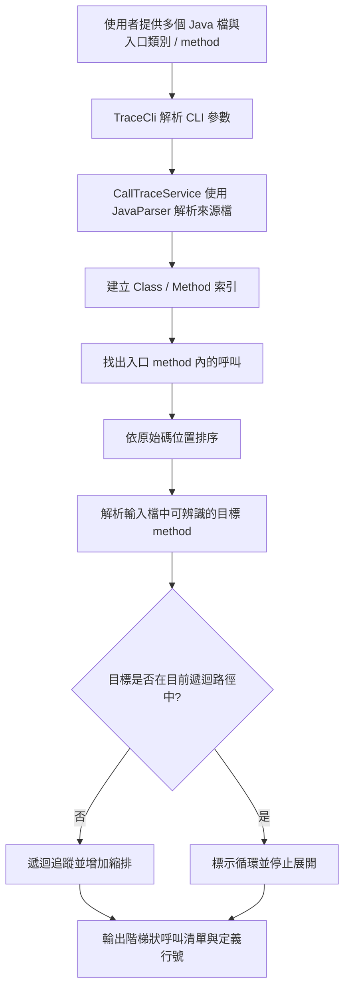

# JavaParser Call Trace MVP

以 **JavaParser** 從指定入口 method 追蹤呼叫，依原始碼順序輸出階層、縮排與 method 定義行號。

專案使用 Java 11，提供 Maven CLI。呼叫範圍由你透過 `--source` 指定；單一檔案可以有多個 method，多個檔案也可以各自有多個 method。

## 功能

- 可重複指定 `--source`，輸入一支或多支 Java 原始碼檔
- 在輸入檔中索引每個類別的多個 method
- 指定入口類別和 method，往下列出被呼叫的 method
- 依 method 呼叫在原始碼出現的位置排序
- 以階梯縮排表示呼叫深度，並顯示 method 定義行號
- 偵測目前呼叫路徑中的循環並停止展開
- 無法在輸入檔中對應的呼叫（例如 JDK 或外部函式庫）會略過

## 架構圖



## 環境需求

- JDK 11 或更新版本
- Maven 3.8 或更新版本

## CLI 使用方式

在專案根目錄開啟 PowerShell 或命令提示字元。每個待分析檔案各加一個 `--source`；`--entry-class` 和 `--entry-method` 指定追蹤起點。

```powershell
mvn exec:java "-Dexec.args=--source examples/Entry.java --source examples/Service.java --source examples/Repository.java --source examples/Log.java --entry-class Entry --entry-method start"
```

參數說明：

| 參數 | 用途 |
| --- | --- |
| `--source <Java檔>` | 要解析的 Java 檔案，可重複指定；只分析列出的檔案 |
| `--entry-class <類別名>` | 呼叫追蹤的起點類別名稱 |
| `--entry-method <方法名>` | 呼叫追蹤的起點 method 名稱 |
| `--help` 或 `-h` | 顯示 CLI 說明 |

例如只追蹤兩支檔案，可省略其他 `--source`：

```powershell
mvn exec:java "-Dexec.args=--source src/main/java/demo/Entry.java --source src/main/java/demo/Service.java --entry-class Entry --entry-method start"
```

入口必須存在於列出的來源檔。路徑以執行命令時的目前目錄為基準；若檔案不在專案目錄，請使用完整路徑。

執行自動化測試：

```powershell
mvn test
```

## 多 method 範例

`examples/Entry.java`、`Service.java`、`Repository.java` 和 `Log.java` 各自包含多個 method。追蹤 `Entry.start()` 時，會只顯示從該入口實際可達的 method；未被呼叫的 method 不會列出。

範例包含同一檔案內的呼叫（`Entry.start()` → `Entry.validate()`）、跨檔案呼叫（`Entry` → `Service` → `Repository`），也包含多個兄弟呼叫及循環呼叫。

輸出：

```text
1  Entry.start()  L2
  1.1  Entry.validate()  L8
    1.1.1  Service.normalize()  L7
      1.1.1.1  Repository.sanitize()  L5
  1.2  Service.check()  L2
    1.2.1  Repository.query()  L2
    1.2.2  Service.notifyUser()  L11
      1.2.2.1  Log.audit()  L5
      1.2.2.2  Entry.start()  L2  [循環，停止展開]
  1.3  Log.write()  L2
```

`L` 後面的數字是該 method 定義所在的原始碼行號。每一層呼叫增加兩個空格；相同父層底下的呼叫會對齊。

## 解析限制

這是使用 JavaParser Core 的輕量靜態分析 MVP，沒有加入 Symbol Solver：

1. `ClassName.method()` 會配對輸入檔中同名類別及同名 method。
2. 沒有 scope 的 `method()` 會先找同類別；找不到時才查輸入檔中的同名 method。
3. 同名候選 method 都會列出，依類別名稱與定義行號排序；目前不以參數型別區分多載。
4. 透過變數呼叫、介面實作、繼承、import 與 Spring DI 的目標解析不保證準確。
5. 輸入檔外的 method 不會追蹤。只解析你明確提供的來源檔，不會掃描整個 repository。

若要精準處理變數型別、多載或介面實作，可在確認 MVP 符合需求後，再評估加入 JavaParser Symbol Solver。

## 專案結構

```text
src/main/java/tw/javalight/calltrace/
  TraceCli.java           CLI 參數與程式入口
  CallTraceService.java   Java 解析、索引與遞迴追蹤
  MethodInfo.java         Method 名稱、類別與行號
src/test/.../CallTraceServiceTest.java
examples/                 多檔、多 method 範例
```
